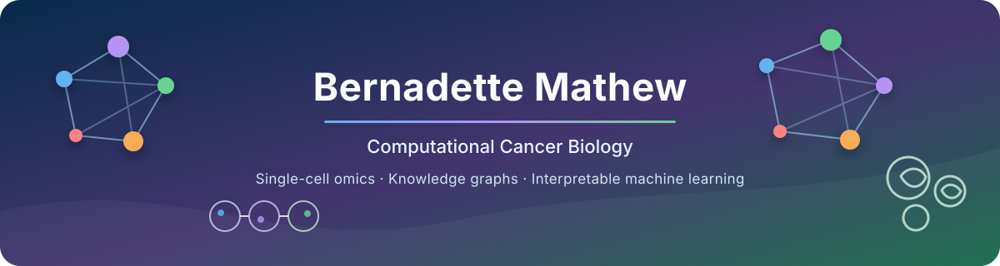

  

  
  
  
  

I am a PhD researcher in **Computational Biology at IIIT-Delhi**, developing interpretable computational methods for single-cell and cancer genomics. My work combines biological knowledge graphs, matrix factorization, and cellular context to study tumor heterogeneity and clinically relevant programs in triple-negative breast cancer.

### Research focus

- Single-cell transcriptomics and cellular heterogeneity
- Triple-negative breast cancer and tumor evolution
- Knowledge-graph-guided representation learning
- Biological network and pathway analysis
- Interpretable machine learning for genomics
- Reproducible scientific software

### Featured research

#### scKNIFE

**A multitask single-cell analysis framework with a knowledge graph as a prior**

scKNIFE integrates biological knowledge graphs with graph-regularized non-negative matrix factorization to connect latent cellular representations with interpretable node programs. The framework supports graph unification, parameter tuning, clustering, cell-type and cell-state assignment, metabolic-task analysis, pathway enrichment, and activity-based cell-cell signaling.

`Python package and documentation preparing for public release`

[Read the preprint](https://doi.org/10.64898/2026.04.25.720773)

### Selected publications

- **A multitask single-cell analysis framework with knowledge graph as a prior.** Mathew B. *et al.* bioRxiv, 2026. [DOI](https://doi.org/10.64898/2026.04.25.720773)
- **Network based simultaneous embedding of cells and marker genes from scRNA-seq studies.** Bhattacharya N. *et al.* *Briefings in Bioinformatics*, 26(5), 2025. [DOI](https://doi.org/10.1093/bib/bbaf537) · [PubMed](https://pubmed.ncbi.nlm.nih.gov/41052280/)

For my complete and current publication record, visit [Google Scholar](https://scholar.google.com/citations?hl=en&user=fh44OjcAAAAJ).

### Methods and tools

  
  
  
  
  
  
  

I value analysis workflows that preserve data provenance, expose parameter choices, separate model-derived results from metadata summaries, and provide reusable outputs for downstream research.

### Connect

- [ORCID](https://orcid.org/0009-0005-8033-2965)
- [Google Scholar](https://scholar.google.com/citations?hl=en&user=fh44OjcAAAAJ)
- [LinkedIn](https://in.linkedin.com/in/bernadette-mathew-842225103)
- [IIIT-Delhi researcher profile](https://iiitd.ac.in/people/phd/current)
- [bernadettem@iiitd.ac.in](mailto:bernadettem@iiitd.ac.in)
